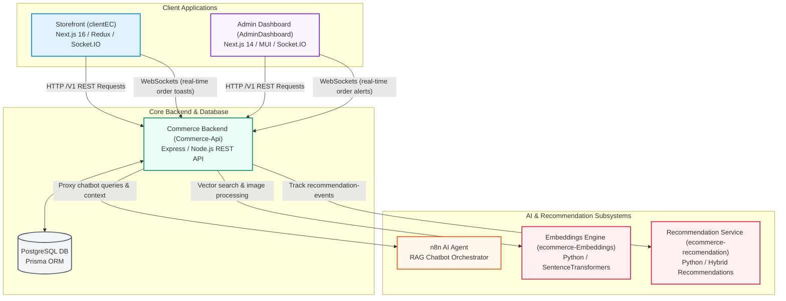
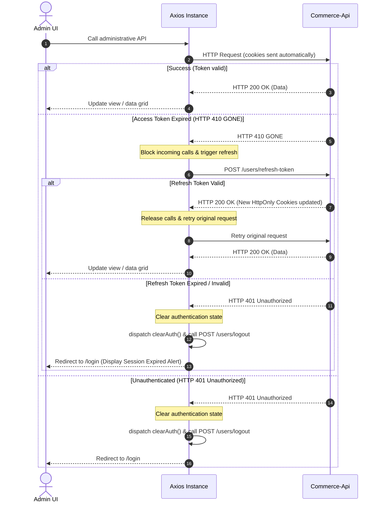

<p align="center">
  
</p>

# NextCommerce — Admin Dashboard

> Back-office administrative management application for the NextCommerce e-commerce platform. Built with Next.js 14, MUI v5, and Redux Toolkit, featuring granular Role-Based Access Control (RBAC) permissions and real-time Socket.IO transaction alerts.

[](https://nextjs.org/)
[](https://react.dev/)
[](https://www.typescriptlang.org/)
[](https://mui.com/)
[](https://redux-toolkit.js.org/)
[](https://socket.io/)

---

## 📋 Table of Contents
- [Overview](#-overview)
- [Ecosystem Placement](#-ecosystem-placement)
- [Tech Stack](#-tech-stack)
- [Project Structure](#-project-structure)
- [Prerequisites](#-prerequisites)
- [Installation](#-installation)
- [Environment Variables](#-environment-variables)
- [Running the App](#-running-the-app)
- [Key Features](#-key-features)
- [Pages & Routes](#-pages--routes)
- [Role-Based Access Control (RBAC)](#-role-based-access-control-rbac)
- [Architecture & Data Flow](#-architecture--data-flow)

---

## 🎯 Overview
**NextCommerce Admin Dashboard** is the back-office management console for the NextCommerce e-commerce platform. It provides store managers, staff members, and system administrators with a comprehensive, secure, and user-friendly interface to handle the entire business cycle.

The project integrates Material UI v5 based on the premium Materio Admin template. Business insights are plotted dynamically using ApexCharts, and product content styling is managed through TipTap rich text editors. Communication with the core backend is structured with strict Axios cookie interception and role-based feature gating.

---

## 🌐 Ecosystem Placement

Below is the architectural mapping of the Admin Dashboard client within the NextCommerce multi-service ecosystem:



### Architectural Role
- **Isolated Back-office**: `AdminDashboard` is completely segregated from the customer-facing codebase (`clientEC`). This prevents the exposure of critical administrative controls and reduces storefront client bundle size.
- **REST Gateway with HttpOnly Security**: The dashboard communicates with the backend `Commerce-Api` (`/V1` routes) using state-less REST calls. Administrative credentials and tokens are secured via browser-level HttpOnly cookies.
- **Real-time Order Alerts**: Listens to server-side transaction socket streams directly to alert staff of incoming purchases with instant sound effects and pop-ups.

---

## 🛠️ Tech Stack

| Category | Technology | Version | Description |
|----------|------------|---------|-------------|
| **Framework** | Next.js (App Router) | `^14.2.3` | Core web framework with React 18 support |
| **Language** | TypeScript | `^5.4.5` | Strict typing and code consistency |
| **Styling** | MUI v5 + Tailwind CSS | `^5.15.19` / `^3.4.4` | Combined utility layout styling with prebuilt Material components |
| **CSS-in-JS** | Emotion (React/Styled) | `^11.11` | Styling system for Material-UI styling elements |
| **State Management** | Redux Toolkit | `^2.11.2` | Manages 10 slices (auth, users, products, orders, roles, permissions) |
| **Rich Text Editor** | TipTap Editor | `^3.16.0` | Product catalog description rich editor |
| **Charts & KPIs** | ApexCharts | `^3.49.1` | Renders sales statistics, graphs, and performance metrics |
| **Icons Engine** | Iconify (CSS-Bundle) | `^2.2.218` | Generates styling-based icon bundles statically |
| **HTTP Client** | Axios | `^1.13.2` | REST operations client with automated cookie refresh interceptors |
| **Realtime** | Socket.IO Client | `^4.8.3` | Receives live system notifications |
| **Forms Validation** | React Hook Form + Zod | `^7.71` / `^4.3` | Client forms validation and parsing |

---

## 📁 Project Structure

```
AdminDashboard/
├── public/                 # Static elements (logo, system images)
├── docs/                   # Developer setup API guidelines
├── src/
│   ├── @core/              # Core theme styles, menus, and template utilities
│   ├── @layouts/           # Base layouts configurations (Vertical, Horizontal navbar layout)
│   ├── @menu/              # Structural sidebar components engine
│   ├── assets/             # System assets including iconify bundles
│   │   └── iconify-icons/  # Script to compile icons dynamically to CSS
│   ├── app/                # Next.js App Router root
│   │   ├── (dashboard)/    # Routes having vertical sidebar menu layout
│   │   ├── (blank-layout-pages)/ # Full-width routes (Login, NotFound, Maintenance)
│   │   ├── layout.tsx      # Entry file setting up Redux, Socket & Theme providers
│   │   └── globals.css     # Global styles configurations
│   ├── views/              # Main functional UI screens per module
│   │   ├── dashboard/      # sales summaries and charts
│   │   ├── products/       # Products catalog listings and CRUD forms
│   │   ├── categories/     # Categories list and creation
│   │   ├── orders/         # Orders history, tracking logs, status workflow updater
│   │   ├── users/          # Users management and active session viewers
│   │   ├── vouchers/       # Discount vouchers list
│   │   ├── roles/          # Custom roles configuration
│   │   └── permissions/    # Permission matrices and CRUD
│   ├── components/         # Common UI components (RichTextEditor, custom modals)
│   ├── configs/            # MUI colors scheme, theme config files
│   ├── constants/          # Global constants (PERMISSIONS, ORDER_STATUS)
│   ├── hooks/              # Custom hooks (e.g. useAuth, useDebounce)
│   ├── libs/               # Dynamic core libraries
│   │   └── api/
│   │       ├── axiosInstance.ts  # Axios interceptors (HttpOnly auth refresh handlers)
│   │       └── endpoints.ts      # Administrative REST endpoints definitions
│   ├── redux/              # Store bootstrap
│   │   ├── store.ts        # Orchestrates 10 slices (users, orders, vouchers, roles)
│   │   └── provider.tsx    # InjectStore hook to bridge axios instances
│   ├── services/           # REST caller classes for API request (auth, roles, order)
│   ├── types/              # Type structures definitions
│   └── utils/              # Helper utilities (permission verifiers, price calculations)
├── next.config.mjs         # basePath configurations & build presets
├── tailwind.config.ts      # Custom Tailwind rules (logical spacing directives)
├── postcss.config.mjs
├── tsconfig.json
├── playwright.config.ts    # Integration browser testing configurations
└── package.json
```

---

## ✅ Prerequisites

- **Node.js**: Version `>= 18.x` (Recommended)
- **Package Manager**: `pnpm >= 10.x` (Recommended)
- **Running Backend**: `Commerce-Api` (running on port `8017` or configured otherwise)

---

## 🚀 Installation

1. **Clone the repository:**
   ```bash
   git clone <repository-url>
   cd AdminDashboard
   ```

2. **Install dependencies:**
   ```bash
   pnpm install
   ```
   *Note: Installing dependencies triggers `pnpm run build:icons` automatically as a post-install hook to generate CSS icon classes.*

3. **Configure environment variables:**
   ```bash
   cp .env.example .env.local
   ```
   *Adjust `NEXT_PUBLIC_API_URL` to point to the correct running Commerce-Api V1 port.*

---

## 🔐 Environment Variables

Setup your `.env.local` with the following variables:

| Variable | Required | Description | Default / Example |
|----------|----------|-------------|-------------------|
| `NEXT_PUBLIC_API_URL` | ✅ | Backend Commerce-Api administrative endpoints URL | `http://localhost:8017/V1` |
| `BASEPATH` | ❌ | Base subpath deployment route (e.g. `/admin`) | `/admin` |

---

## ▶️ Running the App

```bash
# Start development server
pnpm dev

# Compile icon bundles manually
pnpm build:icons

# Build the application for production
pnpm build

# Start production server
pnpm start

# Run ESLint validation
pnpm lint

# Auto-fix ESLint issues
pnpm lint:fix

# Format files using Prettier
pnpm format
```

---

## ✨ Key Features

- **Analytics & Dashboard Overview**: Visualizes sales revenues, daily trends, weekly achievements, and top selling products dynamically using interactive ApexCharts.
- **Product & Category CRUD**: Handles complete product catalogues with multi-image uploads, category hierarchy classification, and product content formatting via TipTap editor.
- **Order State Machine Management**: Tracks orders throughout their full lifecycle logs (e.g. `PENDING` -> `CONFIRMED` -> `SHIPPING` -> `DELIVERED` or `CANCELLED`). Allows staff to manually mark items as paid or print invoices.
- **User Directory & Remote Session Revocation**: Lists all registered customers. Displays active sessions, device fingerprints, and IPs for any user, with the ability to remotely revoke logins to secure accounts.
- **Granular Role-Based Access Control (RBAC)**: Enables creation of customized roles, bulk assignment of permission flags, and automatic UI menu item hiding.
- **Voucher Campaigns Management**: Creates public or private promo vouchers, controls usage limits, set discounts, and monitors active voucher statuses.
- **Real-Time Notification Hub**: Audio-visual notifications alert staff of incoming orders via WebSocket connections.
- **Customer Support Center**: Accesses all contact tickets, support queries, and feedback, with the ability to write direct responses.

---

## 📄 Pages & Routes

All routes are nested inside `src/app/` segment.

| Route Path | Layout Type | Auth | Permissions Required |
|------------|-------------|------|----------------------|
| `/` | Dashboard (Sidebar) | ✅ | Access to view basic dashboards |
| `/products` | Dashboard (Sidebar) | ✅ | `manage_products` / `read_products` |
| `/categories` | Dashboard (Sidebar) | ✅ | `manage_products` |
| `/orders` / `/orders/[id]` | Dashboard (Sidebar) | ✅ | `manage_orders` / `read_orders` |
| `/users` | Dashboard (Sidebar) | ✅ | `manage_users` |
| `/vouchers` | Dashboard (Sidebar) | ✅ | `manage_vouchers` |
| `/contacts` | Dashboard (Sidebar) | ✅ | `manage_contacts` |
| `/roles` | Dashboard (Sidebar) | ✅ | `manage_roles` |
| `/permissions` | Dashboard (Sidebar) | ✅ | `manage_permissions` |
| `/notifications` | Dashboard (Sidebar) | ✅ | Standard session |
| `/account-settings` | Dashboard (Sidebar) | ✅ | Standard session |
| `/login` | Blank (No Sidebar) | ❌ | Public |
| `/forgot-password` | Blank (No Sidebar) | ❌ | Public |
| `/register` | Blank (No Sidebar) | ❌ | Public |

---

## 🔑 Role-Based Access Control (RBAC)

NextCommerce Admin Dashboard enforces strict client-side permission checks:

1. **System Permissions Constants**: Defined inside `src/constants/permissions.ts` (e.g. `manage_users`, `manage_products`, `manage_orders`).
2. **Permissions Fetching**: Upon mounting the shell, the `AuthProvider` triggers a request to fetch current account permissions which are then stored in the `auth` Redux slice.
3. **UI Element Filtering**: The sidebar navigation (`VerticalMenu.tsx`) and action buttons use the `checkPermission(user, permissionsList, requiredPermission)` helper to conditionally render elements.
4. **Admin Override**: Accounts assigned with the `admin` role automatically bypass all checks, granting unrestricted system control.

---

## 📐 Architecture & Data Flow

### 🔐 Token Refresh Interceptor (HttpOnly Cookies)
All administrative cookies (Access & Refresh tokens) are set as `HttpOnly` by the backend. The Axios client (`axiosInstance.ts`) handles token expiration dynamically:



### 🔊 Real-Time Socket Connection
The `SocketProvider` establishes a WebSocket channel immediately after authentication:
- **`ORDER_NEW`**: Triggers desktop notification banners and audio cues to alert staff of incoming orders.
- **`ORDER_STATUS_UPDATED`**: Refreshes tables dynamically without requiring page reloads.
- **Automatic Cleanup**: Sockets are destroyed immediately upon logout or when the token refresh cycle fails.
