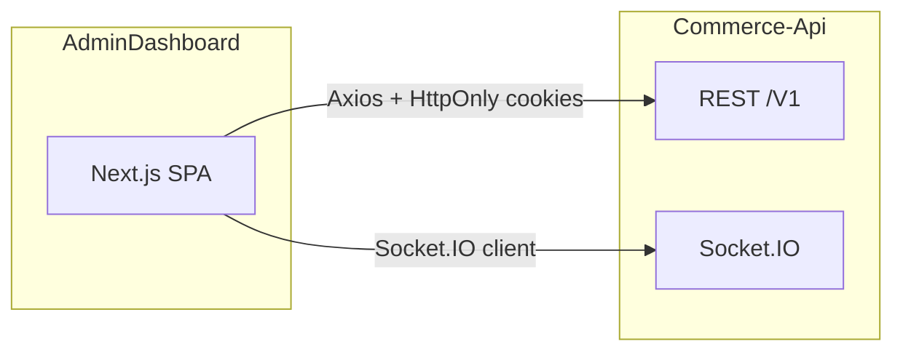

# Admin Dashboard

> Giao diện quản trị (back-office) cho nền tảng thương mại điện tử — **Next.js 14 App Router**, **MUI v5**, **Redux Toolkit**, giao tiếp **REST** với **Commerce-Api** và **Socket.IO** cho thông báo / đơn hàng realtime.


---

## Vị trí trong hệ sinh thái



- **Một backend duy nhất:** mọi API admin đi qua `NEXT_PUBLIC_API_URL` (mặc định `http://localhost:8017/V1`), trùng khớp với Commerce-Api.
- **Socket:** URL suy ra từ API bằng cách **bỏ hậu tố `/V1`** (xem `SocketProvider`) — server Socket.IO cùng host với API.
- **Không** gọi trực tiếp storefront (clientEC) hay service recommender Python; thao tác sản phẩm/danh mục trên admin vẫn đi qua Commerce-Api (có thể kích hoạt reindex phía backend tùy cấu hình).

---

## Mục lục

- [Kiến trúc ứng dụng](#kiến-trúc-ứng-dụng)
- [Công nghệ](#công-nghệ)
- [Cấu trúc thư mục](#cấu-trúc-thư-mục)
- [Luồng xác thực, state và API](#luồng-xác-thực-state-và-api)
- [Phân quyền RBAC](#phân-quyền-rbac)
- [Realtime Socket.IO](#realtime-socketio)
- [Trang và routes](#trang-và-routes)
- [Cài đặt và chạy](#cài-đặt-và-chạy)
- [Biến môi trường](#biến-môi-trường)
- [Tài liệu bổ sung](#tài-liệu-bổ-sung)

---

## Kiến trúc ứng dụng

### Tầng runtime (root `layout.tsx`)

Thứ tự bọc provider (từ ngoài vào trong):

| Thứ tự | Provider | Vai trò |
|--------|----------|---------|
| 1 | `ReduxProvider` | Store tập trung; `injectStore` cho Axios (logout / refresh) |
| 2 | `SocketProvider` | Kết nối Socket.IO khi đã đăng nhập; toast + đồng bộ Redux (đơn, thông báo) |
| 3 | `AuthProvider` | Một lần khi mount: `checkAuth()` + khi đăng nhập: `fetchMyPermissions()` |
| — | `ToastProvider` | `react-hot-toast` (cùng cấp với children trong body) |

Layout **dashboard** (`app/(dashboard)/layout.tsx`): `Providers` (theme + vertical nav context) → `VerticalLayout` với `Navigation` (sidebar), `Navbar`, `Footer`.  
Layout **blank** (`app/(blank-layout-pages)/layout.tsx`): trang auth không sidebar.

### Tầng routing (App Router)

| Nhóm | Đường dẫn gốc | Mục đích |
|------|----------------|----------|
| `(dashboard)/` | `/`, `/products`, `/orders`, … | Trang quản trị có sidebar |
| `(blank-layout-pages)/` | `/login`, `/register`, … | Đăng nhập / đăng ký, không sidebar |
| `[...not-found]` | 404 | Trang không tìm thấy |

**Bảo vệ route:** không dùng `middleware.ts` Next.js. Các trang dashboard dùng **client component** + `useAuth()` + `useEffect` redirect `/login` khi chưa xác thực (ví dụ `app/(dashboard)/page.tsx`).

### Tầng UI

- **`src/app/*/page.tsx`**: entry từng route; thường import view từ `src/views/`.
- **`src/views/`**: màn hình theo domain (dashboard, products, orders, users, …).
- **`src/components/`**: layout (vertical menu, navbar), provider, form dùng chung (`RichTextEditor`, …).
- **`@core/`**, **`@layouts/`**, **`@menu/`**: engine giao diện Materio (theme MUI, menu dọc, scrollbar).

### Tầng dữ liệu

```
Views → dispatch Redux thunks / gọi Services
     → services/*.ts gọi axiosInstance
     → libs/api/endpoints.ts định nghĩa path REST
     → Commerce-Api
```

---

## Công nghệ

| Thành phần | Công nghệ | Ghi chú |
|------------|-----------|---------|
| Framework | Next.js 14 (App Router) | Client components cho phần lớn dashboard |
| UI | MUI 5 + Emotion | Theme, layout |
| Style bổ sung | Tailwind | Utility class |
| State | Redux Toolkit | 10 slice, async thunks |
| Form | React Hook Form + Zod | Validation |
| HTTP | Axios | `withCredentials`, interceptor refresh |
| Realtime | socket.io-client | Đồng bộ đơn & notification |
| Biểu đồ | ApexCharts | Dashboard |
| Rich text | TipTap | Mô tả sản phẩm / danh mục |
| Icons | Iconify (bundle CSS) | `pnpm build:icons` sau đổi icon set |

---

## Cấu trúc thư mục

```
AdminDashboard/
├── public/images/          # Ảnh tĩnh
├── docs/                   # Tài liệu API / hướng dẫn
├── src/
│   ├── app/                # App Router
│   │   ├── layout.tsx      # Redux + Socket + Auth + Toast
│   │   ├── (dashboard)/    # Layout có sidebar
│   │   └── (blank-layout-pages)/
│   ├── views/              # Màn hình theo nghiệp vụ
│   ├── components/         # Layout, providers, shared UI
│   ├── redux/
│   │   ├── store.ts
│   │   ├── slices/         # 10 slice (xem bảng dưới)
│   │   └── provider.tsx    # injectStore(axios)
│   ├── services/           # 11 module: auth, user, product, category, order,
│   │                       # voucher, role, permission, notification, contact (+ index)
│   ├── libs/api/
│   │   ├── endpoints.ts    # Hằng số path → Commerce-Api /V1
│   │   └── axiosInstance.ts  # Interceptor 401 / 410 refresh
│   ├── hooks/              # useAuth, useDebounce, …
│   ├── types/
│   ├── constants/          # PERMISSIONS, ORDER_STATUS, …
│   ├── utils/              # checkPermission, formatters, Zod rules
│   └── configs/            # themeConfig, màu chủ đạo
├── next.config.mjs
├── tailwind.config.ts
├── tsconfig.json
└── package.json
```

### Redux store (10 slices)

| Slice | Nội dung chính |
|-------|----------------|
| `auth` | Phiên đăng nhập, `checkAuth`, login/logout |
| `users` | CRUD user, session |
| `products` | Danh sách / form sản phẩm |
| `categories` | Danh mục |
| `orders` | Đơn hàng admin |
| `vouchers` | Voucher |
| `roles` | Vai trò |
| `permissions` | Quyền + `myPermissions` |
| `notifications` | Hộp thông báo + realtime |
| `contacts` | Liên hệ từ khách (CRUD/reply phía admin) |

---

## Luồng xác thực, state và API

### Auth

1. **Mount:** `AuthProvider` gọi `checkAuth()` → thường là `GET /users/me` (cookie).
2. **Đăng nhập:** `POST /users/login` → backend set **HttpOnly** cookie; Redux cập nhật user.
3. **Đăng xuất:** `POST /users/logout` + `clearAuth()`.
4. **Hết phiên:** Response **410** → interceptor gọi `POST /users/refresh-token` (singleton promise, tránh race) → retry request; thất bại → logout + redirect `/login`.

### API

- **Base URL:** `NEXT_PUBLIC_API_URL` — **phải** kết thúc bằng `/V1` để khớp Commerce-Api.
- **Danh sách endpoint:** tập trung tại [`src/libs/api/endpoints.ts`](src/libs/api/endpoints.ts); từng service import `API_ENDPOINTS` + `axiosInstance`.

---

## Phân quyền RBAC

- Hằng số permission: [`src/constants/permissions.ts`](src/constants/permissions.ts) (`manage_users`, `manage_products`, `manage_orders`, …).
- Sau khi đăng nhập: `fetchMyPermissions()` lưu vào Redux; sidebar trong [`VerticalMenu.tsx`](src/components/layout/vertical/VerticalMenu.tsx) dùng `hasPermission(user, myPermissions, permission)` để ẩn/hiện mục menu.
- **Admin** (role admin): bypass kiểm tra quyền trong `checkPermission` (xem util).
- Menu mặc định: Dashboard, Account settings, Notification history — không khóa theo permission; các module nghiệp vụ khóa theo bảng permission (Users, Products+Categories, Orders, Contacts, Vouchers, Roles+Permissions).

---

## Realtime Socket.IO

- **URL:** `process.env.NEXT_PUBLIC_API_URL.replace('/V1', '')` — cùng origin với API, cổng mặc định **8017** khi dev.
- **Kết nối:** sau khi có access token (refresh nếu cần); ngắt khi logout.
- **Sự kiện tiêu biểu:** đơn mới / đổi trạng thái / thanh toán / hủy; thông báo mới — cập nhật Redux + toast (chi tiết: `SocketProvider`, `types/socket.types.ts`).

**Hook:** `useSocket()` → `socket`, `isConnected`, `newOrderCount`, `resetNewOrderCount`.

---

## Trang và routes

### Dashboard (có sidebar)

| Route | Mô tả ngắn |
|-------|------------|
| `/` | Dashboard KPI + biểu đồ |
| `/products`, `/products/create`, `/products/update/[id]` | Sản phẩm |
| `/categories`, `/categories/create`, `/categories/update/[id]` | Danh mục |
| `/orders`, `/orders/[id]` | Đơn hàng + chi tiết |
| `/users`, `/users/create` | Người dùng |
| `/vouchers`, `/vouchers/create`, `/vouchers/update/[id]` | Voucher |
| `/contacts` | Liên hệ (cần `MANAGE_CONTACTS`) |
| `/roles`, `/roles/create`, `/roles/update/[id]` | Vai trò + gán quyền |
| `/permissions`, `/permissions/create`, `/permissions/update/[id]` | Permission |
| `/notifications` | Lịch sử thông báo |
| `/account-settings` | Cài đặt tài khoản |

### Trang mẫu / demo (template Materio)

| Route | Ghi chú |
|-------|---------|
| `/card-basic`, `/form-layouts` | Component demo, không thuộc nghiệp vụ core |

### Blank layout (không sidebar)

| Route | Mô tả |
|-------|--------|
| `/login`, `/register`, `/forgot-password` | Auth |
| `/error`, `/under-maintenance` | Lỗi / bảo trì |

---

## Cài đặt và chạy

**Yêu cầu:** Node ≥ 18, **pnpm** (khuyến nghị), **Commerce-Api** đang chạy.

```bash
pnpm install
cp .env.example .env.local   # chỉnh NEXT_PUBLIC_API_URL
pnpm dev
```

```bash
pnpm build && pnpm start     # production
pnpm lint                    # ESLint
pnpm build:icons             # bundle Iconify → CSS
```

---

## Biến môi trường

| Biến | Mô tả |
|------|--------|
| `NEXT_PUBLIC_API_URL` | Base REST Commerce-Api, ví dụ `http://localhost:8017/V1` |
| `NEXT_PUBLIC_SITE_URL` | URL gốc admin (SEO / link tuyệt đối nếu dùng) |
| `NEXT_PUBLIC_DEV_TOOLS` | Công cụ dev (nếu có) |
| `BASEPATH` | Base path Next.js khi deploy subpath |

Chỉ dùng `NEXT_PUBLIC_*` cho dữ liệu **không nhạy cảm** — token nằm trong **HttpOnly cookie** do backend cấp.

---

## Tài liệu bổ sung

Thư mục [`docs/`](docs/) — API chi tiết, migration FE, multi-image, v.v. Xem file trong repo để cập nhật danh sách chính xác theo từng phiên bản.

---

## Tác giả

**DHVuxDev**

---

<p align="center">Admin dashboard cho quản trị e-commerce — tách biệt storefront, gắn chặt Commerce-Api.</p>
